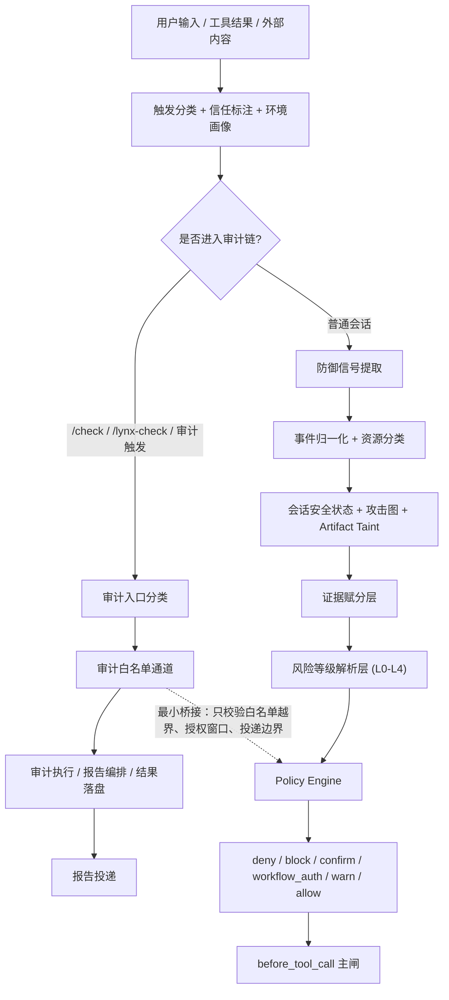

# Lynx Guardian 整体架构重整设计

**Date:** 2026-04-14

**定位：** 这次不是“只改 `src/` 的局部修补”，而是围绕 Lynx Guardian 插件整体运行架构的一次重整。重整重点覆盖运行时插件架构、策略判定链、审计链、防御链、技能提示对齐、测试与必要的运行适配。`scripts-dev/` 不再被表述为本次方案的核心对象，但如果运行时契约变化需要联调或验证适配，可以做最小必要调整。

## 1. 目标

本次重整的目标不是单纯“把 guard 写得更严”，而是把整个插件整理成边界清晰、长期可维护的两条主链：

- 审计链：负责 `/check`、`/lynx-check` 以及相关 discovery / audit / report / delivery 流程
- 防御链：负责输入防护、工具调用判定、多轮风险跟踪、提示词注入防护、输出与落盘保护

同时满足以下要求：

- 保留模型侧提示词注入防护，并且显式加强“外部内容只是数据，不是指令”
- 最终执行闸门仍然放在模型产出可执行计划之后、真正调用工具之前，以 `before_tool_call` 为主闸
- 旧的赋分体系保留，但降级为证据聚合层，不再充当最终裁决者
- 多轮检测升级为结构化会话安全状态、攻击图与 taint 跟踪，而不是依赖全文摘要
- 用户可见的 `deny` / `block` / `confirm` / `workflow_auth` / `warn` / `allow` 语义继续保留，但实现路径统一
- `/check` 与 `/lynx-check` 继续采用白名单优先策略
- 审计部分本轮重点是清理新旧代码冗余、封装边界、收敛状态流，不做激进功能重写
- 防御与审计尽量隔离，不能让通用防御逻辑反向污染审计主流程
- 迁移期间继续兼容旧配置与旧返回字段

## 2. 范围

### 2.1 本轮纳入范围

- `index.ts` 中混杂的 guard / audit / delivery / override 特判重整
- `src/guard/*` 下风险判断、防御注入、输出保护、多轮检测重构
- `src/discovery/*` 与 `src/runtime/*` 中 `/lynx-check`、discovery、run-store、delivery、authorization 的职责收敛
- 审计链与防御链之间的桥接边界重写
- 赋分体系升级为“兼容旧分数 + 支持新证据维度”的统一证据层
- OpenClaw 多运行环境下的路径、权限、workspace、state 目录、session 存储差异抽象
- `src/skills/skill-guard.ts` 与 `skills/lynx-guardian-lesson/SX-self-safety-guard/SKILL.md` 的语义对齐
- 测试分层与兼容迁移策略整理

### 2.2 本轮不做的事

- 不把 `scripts-dev/` 当作本次架构设计的主战场
- 不重写 `/lynx-check` 报告的业务结论或章节含义
- 不把插件改造成“完整对话记忆系统”
- 不在本轮一次性替换所有 blacklist / API / 远端情报实现
- 不为了架构美观而大规模改动与安全主线无关的功能

## 3. 当前结构性问题

### 3.1 `index.ts` 承担了过多业务特判

当前同一个入口文件里同时混有：

- `/check`、`/lynx-check` 精确命令触发识别
- managed `/lynx-check` 预授权与白名单放行
- 普通 guard、override、workflow auth、feedback
- 审计报告 inline/fallback 投递
- Feishu / WebChat 等投递 shaping

这让“通用平台安全逻辑”和“审计业务特例”缠在一起，维护成本持续上升。

### 3.2 防御判定链分散，最终语义不稳定

今天的风险结论分散在多个地方：

- `src/guard/safety-guard.ts`
- `src/guard/result-guard.ts`
- `index.ts`
- blacklist 硬规则
- API 风控补充
- override / workflow auth 运行态

这导致相同操作可能经过多层部分重叠的判断，最终为什么被挡、能否确认、能否授权，很难从一处读懂。

### 3.3 赋分体系承担了过多职责

当前 weighted score 同时承担：

- 风险热度表达
- block / warn 的部分驱动
- 多轮升级的部分替代物
- 缺少结构化状态时的兜底判断

结果就是“分数像系统本身”，而不是“系统的一份证据”。

### 3.4 审计链存在明显的新旧双轨

现状里 `/lynx-check` 已经主要依赖：

- `src/runtime/lynx-check-run-store.ts`
- `src/runtime/managed-lynx-check-authorization-store.ts`
- `src/runtime/lynx-check-prompt.ts`

但 `agent_end` 以及若干兜底流程里，仍然保留：

- `pending-discovery-store.ts`
- 旧版 discovery 文件中转
- 多条投递 target 兜底链

这让调试时很难一眼判断当前到底走的是“新主链”还是“旧遗留链”。

### 3.5 运行环境差异没有被显式建模

OpenClaw 的实际运行环境并不单一，至少存在以下差异：

- Windows 主机路径、macOS/Linux 主机路径与 Linux 容器路径不同
- `%USERPROFILE%\\.openclaw`、`/home/node/.openclaw`、`/app/extensions/openclaw-lynx-guardian` 指向不同角色
- 某些目录在宿主机可写，在容器内可能只读，或者需要 root
- cron 状态、技能目录、插件目录、运行报告目录并不总在同一工作目录下
- Docker 的 workspace mount 与 stateDir 可以分离，导致 session、artifact、workspace 不再天然同目录

例如当前 Docker 配置已经明确体现出这种分离：

- `OPENCLAW_STATE_DIR=/home/node/.openclaw/docker-state`
- `OPENCLAW_WORKSPACE_DIR` 挂载到 `/home/node/.openclaw/workspace`

这意味着 session 实际可能落在宿主机的 `C:\Users\24716\.openclaw\docker-state\agents\main\sessions`，而不是开发者直觉里的 workspace 目录。

如果 guard、审计、白名单都直接依赖“硬编码路径 + 当前工作目录假设”，就会不断出现误判与环境相关 bug。

## 4. 核心设计原则

### 4.1 两条主链，边界清楚

- 审计链负责“发现、审计、组装报告、投递报告”
- 防御链负责“识别风险、限制执行、维持会话安全状态、保护模型与输出”
- 两条链只通过显式桥接层交互，不再在 `index.ts` 中大量穿插特判

### 4.2 防御是确定性闸门，不是模型自觉

- 模型侧安全提示必须保留并增强
- 但最终工具是否执行，仍由确定性判定层决定
- 主闸位置仍以 `before_tool_call` 为准

### 4.3 审计优先保证可执行与可送达

- `/check` 与 `/lynx-check` 继续走白名单优先
- 通用防御不能反复“语义重审”审计内部每一步
- 审计内部步骤只要仍在受控白名单内，就不应被普通 guard 流阻断

### 4.4 分数只做证据聚合，不做最终裁决

- 分数保留，用来表达热度、解释风险、驱动模型姿态与兼容旧接口
- 最终 allow / block / confirm / workflow_auth 不由分数单独决定

### 4.5 多轮检测必须结构化、有限窗、可回收

- 依赖 `sessionKey`
- 依赖结构化事件与攻击图
- 依赖 artifact taint
- 不依赖无限期 transcript summary

### 4.6 环境差异必须先归一化，再做安全判断

- 先识别运行平台、资源身份、权限能力、workspace/state/session 实际落点
- 再决定哪些路径等价、哪些操作可达、哪些白名单成立
- 不允许把“Windows 本机路径”“宿主 `.openclaw` 路径”“容器内运行路径”“workspace mount 路径”直接当成同一层规则去匹配

## 5. 环境抽象层设计

这次重整新增一个明确的环境抽象层，用来解决文件系统差异、权限隔离、工作目录差异。

这里要明确区分两类概念：

- 运行平台维度：Windows 宿主、macOS 宿主、原生 Linux 宿主、Docker 容器运行时
- 运行态目录维度：插件运行目录、OpenClaw Home、workspace mount、state 目录、session store 目录

本轮只针对 OpenClaw 真实运行场景建模，不把 Git worktree 当成正式运行环境的一部分。

### 5.1 引入 Runtime Environment Profile

插件在运行时先解析一份环境画像，至少包含：

- `platform`: `windows-host` / `mac-host` / `linux-host` / `docker-runtime` / `unknown`
- `pluginSourceRoot`: 当前插件源码目录
- `pluginRuntimeRoot`: 真正被网关加载的插件目录，例如 `/app/extensions/openclaw-lynx-guardian`
- `openclawHome`: 宿主或容器侧 `.openclaw` 根目录
- `workspaceMountRoot`: OpenClaw 工作区挂载点，例如 `/home/node/.openclaw/workspace`
- `stateDir`: 实际状态目录，例如 `OPENCLAW_STATE_DIR=/home/node/.openclaw/docker-state`
- `sessionStoreRoot`: 实际 session 存储目录，例如 `C:\Users\24716\.openclaw\docker-state\agents\main\sessions`
- `permissionProfile`: 当前进程对关键目录的读写/执行能力画像

其中：

- `platform=mac-host` 表示原生 macOS 运行环境
- `platform=linux-host` 表示原生 Linux 运行环境，不依赖 Docker
- `platform=docker-runtime` 只表示插件运行在容器内，不等于所有状态都在容器文件系统内
- `workspaceMountRoot`、`stateDir`、`sessionStoreRoot` 允许彼此分离，不能默认共址

### 5.2 路径判断不再直接依赖原始字符串

所有安全相关路径都先归一化为资源身份，而不是直接比较原始路径文本。例如：

- “插件源码”是一个资源类，不是单一绝对路径
- “运行时插件副本”是另一个资源类
- “宿主 `.openclaw` 下的技能目录”与“容器 `/app/extensions` 下的技能副本”不能混为一谈
- “workspace 中的文件”与“stateDir 下的 session / report / cron store”不能混为一谈

因此新的 guard / audit / whitelist 应先走：

1. 路径标准化
2. 资源映射
3. 权限能力判断
4. 再进入策略判定

### 5.3 白名单要带环境语义

例如 managed `/lynx-check` 的白名单不能只是“允许读取某些路径字符串”，而应表达成：

- 允许读取“当前运行环境中的插件源码或运行时镜像”
- 允许读取“当前运行环境中的技能目录”
- 允许读取“当前运行环境中的 `openclaw.json` 与受控报告目录”
- 允许读取“当前运行环境中的 session / artifact / audit run store”
- 允许执行“当前环境下可验证为只读、安全、查询型”的命令

这样才能同时覆盖：

- Windows 本地开发
- macOS 本地开发
- 原生 Linux 部署
- Docker 里的真实运行

### 5.4 权限隔离要进入判定上下文

策略引擎与审计链都必须知道：

- 当前目录是“逻辑可写但物理不可写”，还是“需要 root 才能写”
- 当前插件运行看到的是宿主副本还是容器内打包副本
- 当前 audit artifact / session / report 是落在宿主 `.openclaw`、容器状态目录，还是 workspace mount
- 当前 Docker 配置是否把 workspace 与 stateDir 分开，导致 session 实际落到 `docker-state/agents/.../sessions`

否则会出现“规则允许，但环境根本不成立”的假放行，或者“路径不一致导致误拦截”的假阻断。

## 6. 总体架构

这个图的含义是：

- 审计链和防御链从入口开始就分开
- 审计链内部优先走受控白名单通道
- 防御链先产出显式 L0-L4 风险等级，再决定执行闸门动作
- 审计链只有在“越界”时才桥接到策略引擎，而不是让策略引擎不断干扰其内部流程

## 7. 审计子系统设计

### 7.1 审计链的责任

审计链负责以下事情：

- 识别 `/check`、`/lynx-check` 精确命令触发
- 运行 discovery、审计脚本、技能校验、恶意脚本扫描
- 组装中文审计报告
- 维护 run intent / result / report 的统一状态
- 决定 inline、fallback、fanout 等投递方式
- 维护定时任务与 managed audit 预授权

当前主要落点包括：

- `src/discovery/lynx-check-trigger.ts`
- `src/discovery/manual-lynx-check.ts`
- `src/discovery/openclaw-discovery.ts`
- `src/discovery/lynx-check-report-template.ts`
- `src/runtime/security-audit-runner.ts`
- `src/runtime/lynx-check-run-store.ts`
- `src/runtime/lynx-message-delivery.ts`
- `src/runtime/lynx-webchat-delivery.ts`
- `src/runtime/managed-lynx-check-authorization-store.ts`
- `src/runtime/scheduled-lynx-check.ts`

### 7.2 `/check` 与 `/lynx-check` 的边界

- `/check` 继续视作原生命令白名单透传，不纳入普通语义型风险判定主链
- `/lynx-check` 继续视作托管审计命令，进入 managed audit 流程
- 审计入口只接受精确命令 `/check` 与 `/lynx-check`
- 原先其他自然语言、关键词、模糊匹配触发一律移出白名单链路
- 如果用户只是口头描述“帮我检查一下”之类内容，应回到普通会话与防御链处理，不再自动劫持进入审计链

### 7.3 审计链本轮只做“边界清理 + 冗余收敛”

本轮对审计部分不做激进功能重写，重点是：

- 收敛 run-store 与旧 pending-discovery 双轨状态
- 收敛投递 target 决策与兜底链
- 收敛 prompt 生成、报告模板、运行状态、授权状态之间的边界
- 把 `/lynx-check` 相关特判从 `index.ts` 中搬到可维护模块

优先保留的现有思路包括：

- 手动 `/lynx-check` 先预计算，再由模型直出完整报告
- 定时 `/lynx-check` 仍通过托管链路生成并投递完整报告
- `/lynx-check` 的自检白名单继续保持“窄白名单”原则
- 审计触发关键词先缩减到只保留 `/check` 与 `/lynx-check`

### 7.4 审计链不得被通用防御污染

这次方案明确规定：

- 防御链不能因为普通语义评分高，就阻断审计链内部白名单内步骤
- 防御链不能改写审计报告的业务内容与章节语义
- 防御链不能把 managed audit 内部正常读写当成普通高危越权操作处理

防御链只允许在以下场景介入：

- 审计触发来源不可信或冒名
- 审计内部工具调用超出白名单
- 审计访问了不属于审计边界的受保护资源
- 审计投递目标越过受控发送边界
- 审计落盘对象与运行环境画像不匹配，出现污染或伪造风险

也就是说，防御链只看“审计有没有越界”，而不是反复审查“审计是不是危险”。

## 8. 防御子系统设计

### 8.1 防御链的责任

防御链负责：

- 输入归一化与信任标注
- 提示词注入与越权意图识别
- 工具调用前的确定性闸门判定
- 多轮会话安全状态维护
- 攻击图推进与 artifact taint 跟踪
- 输出泄漏与持久化保护
- workflow auth / confirm / deny / warn 等语义执行

### 8.2 统一策略架构

新的防御主链分为以下层次：

1. `Signal Extractors`
   负责把输入、工具调用、输出中的风险线索抽成结构化信号

2. `Event Normalizer`
   把不同来源事件统一成标准事件模型，例如：
   - `input`
   - `tool`
   - `output`
   - `artifact`

3. `Resource Classifier`
   把目标对象归类为稳定的安全资源类型，例如：
   - `guard_code`
   - `credential`
   - `system_file`
   - `workspace_code`
   - `artifact`
   - `external_sink`
   - `audit_runtime_resource`

4. `Session Security State`
   负责多轮状态、可信任务目标、近期异常 turn、工作流授权窗口

5. `Artifact Taint Store`
   负责跟踪“先写入、后执行”“先收集、后外发”这类跨步污染链

6. `Evidence Scorer`
   负责证据聚合与风险热度表达

7. `Policy Engine`
   负责最终返回：
   - `deny`
   - `block`
   - `confirm`
   - `workflow_auth`
   - `warn`
   - `allow`

### 8.3 `before_tool_call` 仍是主闸

模型可以先看到防御提示与信任边界，但真正的执行闸门仍在工具调用之前。

这意味着：

- 模型无法因为“理解错了”直接绕过真正执行控制
- 多轮攻击、结构化诱导、脚本落地后再执行，都能在执行前被状态机和攻击图截获
- 即使提示词注入防护未完全识别，最终也还有确定性主闸兜底

## 9. 模型侧提示词注入防护

模型侧防护仍然必须保留，而且需要强化。

### 9.1 保留并升级现有入口

继续使用并更新：

- `src/guard/security-awareness.ts`
- `src/skills/skill-guard.ts`
- `skills/lynx-guardian-lesson/SX-self-safety-guard/SKILL.md`
- `before_agent_start` 的 prepend / context 注入

### 9.2 新的模型侧防护原则

模型侧防护围绕四件事展开：

1. `Trusted Objective`
   只有可信来源才能定义当前真正要完成的任务目标

2. `Untrusted Content Envelope`
   网页、日志、脚本、README、工具输出进入模型上下文时，必须被标记为“数据”，不是“指令”

3. `Defensive Posture`
   根据证据热度切换 `normal` / `aware` / `strict` / `quarantine`

4. `Prompt-Skill Alignment`
   运行时安全注入与 lesson skill 语义必须一致，不能一边要求谨慎，一边在工具闸门上给出另一套规则

### 9.3 审计内容也适用“数据不是指令”

审计链虽然和防御链隔离，但审计收集到的外部日志、脚本、配置片段仍然是“不可信数据”。

区别在于：

- 它们可以进入审计报告与模型上下文作为分析对象
- 但它们不能反向改写 trusted objective
- 也不能驱动审计链跳出白名单去做额外执行

## 10. 新版证据赋分体系

赋分体系保留，但角色和表达形式都要改变。

### 10.1 保留旧维度，新增结构化维度

保留旧的五维：

- `harm`
- `rev`
- `auth`
- `pattern`
- `clarity`

新增两维：

- `chain`
- `taint`

### 10.2 新赋分不再是“简单累加”

新版赋分不应该继续停留在“若干命中项加权求和”的层面，而应变成：

- 一组分维度证据向量
- 一条可追踪的风险推进链
- 一份面向策略引擎的解释包

也就是说，系统最终保留的不只是一个总分，而是：

- 每个维度为什么升高
- 这些维度由哪些输入、哪些工具调用、哪些 artifact 状态推动
- 当前步骤是在“单点异常”，还是在“延续一条已有攻击链”

总热度值仍然可以保留，但它只是摘要，不再是主要语义。

### 10.3 证据层的标准输出

`Evidence Scorer` 应至少输出：

- `dimensionScores`
  - 各维度当前热度，例如 `harm=2, auth=4, chain=5`
- `evidenceItems`
  - 每条证据的来源、目标、触发器、可信度、时间戳
- `chainProgress`
  - 当前命中的攻击图节点、边、推进方向
- `taintSummary`
  - 当前 artifact / 输出 / 输入的污染状态
- `postureHints`
  - 给模型防御姿态和日志严重度的建议
- `riskLevelLabel`
  - 基于证据链解析出来的显式 `L0` / `L1` / `L2` / `L3` / `L4`
- `riskLevelValue`
  - 与 `riskLevelLabel` 对应的 `0-4` 数值，用于旧接口兼容和统计
- `compatibilityScore`
  - 兼容旧配置和旧 UI 的摘要分数字段

这样策略引擎看到的就不是“一个 8 分”，而是：

- 为什么是 8 分
- 8 分里哪部分来自越权倾向，哪部分来自链式推进
- 当前证据链最终落在 `L0-L4` 的哪一级
- 在这个等级之上，是否已经具备 deny / block / confirm / workflow_auth 的判定条件

### 10.4 分数在审计链中的位置

分数在审计链中只作为辅助证据，主要用于：

- 识别“触发审计的输入本身是否带有异常诱导”
- 标记“审计链是否正在越界”
- 记录“本次 managed audit 的风险热度摘要”

它不应该用于阻断审计链内部正常白名单步骤。

### 10.5 热度计算的具体方法

新版“热度”不再采用简单线性累加，而采用“分维度取值 + 链路修正 + 置信度折扣 + 上下文门控”的方式。

建议每个维度单独计算 `0-5` 的离散热度：

- `harm`
  - 看目标动作本身的潜在危害
- `rev`
  - 看是否不可逆、是否会造成持久破坏
- `auth`
  - 看是否存在明确授权、可信所有权、工作流授权窗口
- `pattern`
  - 看当前步骤命中了多少危险模式或硬规则
- `clarity`
  - 看用户目标是否清晰、边界是否明确、脚本内容是否可见
- `chain`
  - 看是否处在攻击图推进中，以及推进到了哪一步
- `taint`
  - 看当前输入、artifact、脚本、输出是否已被不可信内容污染

每个维度由多条证据命中后，先在维度内聚合，再做饱和裁剪，而不是无限相加。

可以按下面的思路实现：

1. 对每条证据产出：
   - `dimension`
   - `weight`
   - `confidence`
   - `source`
   - `resource`
   - `reason`

2. 维度内聚合：
   - `rawDimension = Σ(weight × confidence × contextFactor)`
   - 再映射到 `0-5`
   - 推荐采用饱和函数，而不是线性求和

例如：

- `dimensionScore = min(5, round(rawDimension))`
- 或采用分段阈值：
  - `0`: 无证据
  - `1`: 弱提示
  - `2`: 明确可疑
  - `3`: 高风险
  - `4`: 强烈危险
  - `5`: 关键推进节点

3. 链路修正：
   - 当攻击图从“读敏感文件”推进到“写 artifact”再推进到“执行/外发”时，`chain` 不按简单命中数累加，而按节点阶段提升
   - 当 artifact 已带 taint，再被执行或外发时，`taint` 与 `chain` 同时提升

4. 上下文门控：
   - 有明确用户确认或 `workflow_auth` 时，`auth` 可以回落
   - 目标不清晰、脚本不可见时，`clarity` 升高
   - 审计白名单内正常步骤，不触发普通执行风险维度升级

5. 最终摘要热度：
   - 不再简单 `sum(dimensions)`
   - 建议使用“主维度 + 次维度 + 链路加权”的摘要法

推荐公式：

- `summaryHeat = max(top1, ceil((top1 + top2) / 2), chainAdjustedHeat)`

其中：

- `top1/top2` 是最高的两个维度
- `chainAdjustedHeat` 是根据攻击图阶段计算出的链路热度

这样做的目的，是让“单一低危命中很多次”不会伪装成“关键攻击链已成型”，也让“一个关键危险节点”不会被平均数稀释掉。

## 10.6 后端 API 兼容策略

根据当前后端实现：

- [records.py](D:\all-sunday\openclaw-lynx\lynx\app\routers\records.py) 的 `/content_check` 返回：
  - `is_safe`
  - `risk_level`
  - `level_one`
  - `level_two`
  - `level_three`
- 其中 `level_one/level_two/level_three` 是分类链，不是风险等级
- `risk_level` 才是后端当前对外暴露的简化等级字段
- `/tool_check` 返回：
  - `is_safe`
  - `risk_level`
  - `content`
- `/push_record` 目前只接受：
  - `is_safe`
  - `risk_level`

这意味着新版插件必须遵守一个兼容原则：

- 分类字段继续当“类别标签”用
- 热度与证据链是插件内部新语义
- 旧接口继续收到可落库、可展示、可统计的 `risk_level`

### 10.6.1 字段语义重新对齐

- `level_one/level_two/level_three`
  - 继续表示后端裁判模型给出的类别层级
  - 绝不能在插件里被当成 severity 等级直接使用

- `risk_level`
  - 继续作为旧接口兼容字段
  - 表示对外的简化风险等级
  - 用于历史记录、旧统计、旧 UI、旧告警链

- `dimensionScores / evidenceItems / chainProgress / taintSummary`
  - 属于插件内部新证据层
  - 不要求后端旧接口立即理解

### 10.6.2 兼容映射策略

插件内部先形成：

- `riskLevelLabel`
- `riskLevelValue`
- `policyDecision`
- `summaryHeat`
- `dimensionScores`
- `evidenceItems`

然后再把 `riskLevelValue` 直接映射到旧接口兼容值：

- `legacyRiskLevel`

建议映射如下：

- `L0` -> `0`
- `L1` -> `1`
- `L2` -> `2`
- `L3` -> `3`
- `L4` -> `4`

这层映射的含义是：

- 风险等级先由评分体系 + 证据链解析出来，而不是由最终动作反推
- 旧接口拿到的仍然是一个稳定、可统计的等级值
- 新系统真正依赖的是 `riskLevel + policyDecision + evidence`
- 不再让旧的 `risk_level` 反过来主导新策略

### 10.6.3 content_check 的协调方式

对于 `/content_check`：

- 插件仍接收 `risk_level + level_one/level_two/level_three`
- `level_one/level_two/level_three` 只进入分类证据，不直接转等级
- 后端返回的 `risk_level` 只作为外部参考信号之一
- 插件再结合本地：
  - 资源分类
  - session state
  - chain
  - taint
  - environment profile
  形成最终策略结论

也就是说：

- 后端分类结果是“外部裁判意见”
- 插件策略引擎才是“最终本地执行裁决”

### 10.6.4 tool_check 的协调方式

对于 `/tool_check`：

当前后端把“不安全工具调用”基本统一折成 `risk_level=2`，其本意是“需要确认”，不是精细风险分级。

所以插件侧不应把这个 `2` 理解为“中危分数”，而应理解为：

- 这是一个外部确认门信号
- 它支持 `confirm` / `workflow_auth` 分支
- 但不能替代本地的 `deny/block` 确定性判断

### 10.6.5 push_record 的协调方式

当前 `/push_record` 只有：

- `content`
- `is_safe`
- `risk_level`

所以短期内不要要求后端立刻理解完整证据链。

短期方案：

- 继续推送 `risk_level`
- 在 `content` 中写入简短摘要或事件标识
- 完整证据链留在插件本地日志、run-store、审计记录中

中期方案：

- 后端新增可选字段，例如：
  - `policy_decision`
  - `summary_heat`
  - `dimension_scores`
  - `evidence_summary`
- 但要保持旧字段不删，避免老客户端和旧查询逻辑失效

### 10.6.6 查询接口的现状约束

当前 [schemas.py](D:\all-sunday\openclaw-lynx\lynx\app\schemas.py) 里的 `Record` schema 并没有把数据库中的 `risk_level` 暴露在 `/query` 返回结构里，只返回：

- `content`
- `content_type`
- `is_safe`
- `cp_result`
- `gt_result`

这说明后端当前“写入的风险等级”和“查询展示的结构”本身就不完全对称。

所以本轮兼容设计要避免一个错误前提：

- 不能假设“后端已有 risk_level 字段”就等于“所有查询消费者都能直接看到这个等级”

更稳妥的方案是：

- 插件侧继续兼容写入旧字段
- 新证据结构先在插件本地和运行时策略层落地
- 后端若后续扩展查询接口，再增量暴露新字段

### 10.6.7 接口协调清单

为了避免插件侧与后端侧各自演化，先约定一份明确的协调清单。

1. `/content_check`
   - 保留现有返回结构：`is_safe`、`risk_level`、`level_one`、`level_two`、`level_three`
   - 插件侧把 `level_one/level_two/level_three` 当作类别链，不当作等级
   - 插件侧把后端 `risk_level` 当作外部参考信号，不当作最终裁决
   - 插件内部再结合本地证据层生成 `policyDecision`

2. `/tool_check`
   - 保留现有返回结构：`is_safe`、`risk_level`、`content`
   - 插件侧把 `risk_level=2` 理解成“需要确认”的旧兼容信号
   - 本地仍允许依据攻击图、taint、环境边界升级为 `block` 或 `deny`

3. `/push_record`
   - 短期继续只推旧字段：`content`、`is_safe`、`risk_level`
   - `risk_level` 由插件内部 `policyDecision -> legacyRiskLevel` 映射得出
   - 完整证据链暂不要求后端立刻接收

4. `/query`
   - 现状只返回 `content`、`content_type`、`is_safe`、`cp_result`、`gt_result`
   - 不能假设所有消费方都能直接看到 `risk_level`
   - 若后端后续扩展查询结构，应新增可选字段，不破坏旧结构

5. 后端 `risk_level` 统一兼容映射
   - `allow` 且热度很低 -> `0`
   - `warn` -> `1`
   - `confirm` / `workflow_auth` -> `2`
   - `block` -> `3`
   - `deny` -> `4`

6. 后端扩展字段原则
   - 允许新增：`policy_decision`、`summary_heat`、`dimension_scores`、`evidence_summary`
   - 不删除旧的 `risk_level`
   - 不改变 `level_one/level_two/level_three` 的类别语义

## 11. 多轮检测与状态生命周期

### 11.1 多轮检测不是 transcript 总结

插件的职责不是保存并总结整段对话，而是维护安全相关状态。

新的多轮检测核心是：

- `sessionKey` 维度的隔离
- 可信任务目标
- 近期异常用户 turn
- 结构化攻击图进展
- artifact taint
- 工作流授权窗口

### 11.2 重点捕获的链式行为

要能识别例如：

- 先进入敏感目录，再读敏感文件，再修改
- 先拉取脚本，再保存脚本，再执行脚本
- 先读取敏感信息，再转存到 artifact，再发送到外部
- 先用外部内容诱导，再在后续 turn 中触发越权执行

### 11.3 六类重置 / 回收条件

保留并显式实现以下规则：

1. `sessionKey` 变化，直接隔离
2. 长时间无活动，按窗口过期
3. 用户明确切换任务主线，重置 trusted objective
4. `agent_end` 或 workflow 完成后，回收 workflow auth
5. 连续 4-5 个安全无关 turn，危险态衰减
6. artifact 生命周期结束后，清除其 taint

## 12. Policy Engine 的语义

### `deny`

- 绝对红线
- 用户不能通过确认把它打开
- 典型场景：凭据窃取、核心 guard 自修改、明确外发攻击链
- 常见对应等级：`L4`（这里是常见组合，不是由动作反推等级）

### `block`

- 当前条件不满足，先停下
- 不提供危险操作确认
- 典型场景：目标不清晰、授权上下文缺失、脚本内容不可见、环境条件不成立
- 常见对应等级：`L3`

### `confirm`

- 这是一个明确、单次、可描述的危险步骤
- 需要用户批准这一步本身
- 批准后只放这一步
- 常见对应等级：`L2`

### `workflow_auth`

- 识别到的是一个有边界的多步工作流
- 用户授权的是短时窗口，不是关闭安全防护
- 适用于“查看配置 -> 修改配置 -> 重启 -> 看日志”这类连续流程
- 常见对应等级：`L2`

### `warn`

- 允许执行
- 但提高监控与模型警惕姿态
- 常见对应等级：`L1`

### `allow`

- 正常通过
- 常见对应等级：`L0`

## 13. 模块重整方向

这里先定义“逻辑分层”，不强制第一阶段立刻完成所有物理搬迁。

### 13.1 审计域

建议把现有逻辑收敛为以下逻辑模块：

- `audit-trigger`
  - 现状来源：`src/discovery/lynx-check-trigger.ts`

- `audit-report-service`
  - 现状来源：`src/discovery/manual-lynx-check.ts`
  - `src/discovery/lynx-check-report-template.ts`
  - `src/runtime/security-audit-runner.ts`

- `audit-run-store`
  - 现状来源：`src/runtime/lynx-check-run-store.ts`
  - 逐步替代旧的 pending discovery 状态流

- `audit-delivery`
  - 现状来源：`src/runtime/lynx-message-delivery.ts`
  - `src/runtime/lynx-webchat-delivery.ts`
  - `src/runtime/recent-active-delivery.ts`

- `audit-authorization`
  - 现状来源：`src/runtime/managed-lynx-check-authorization-store.ts`
  - `src/runtime/scheduled-lynx-check.ts`

### 13.2 防御域

- `src/guard/policy/event-normalizer.ts`
- `src/guard/policy/resource-classifier.ts`
- `src/guard/policy/evidence-scorer.ts`
- `src/guard/policy/session-security-state.ts`
- `src/guard/policy/artifact-taint-store.ts`
- `src/guard/policy/attack-graph.ts`
- `src/guard/policy/environment-profile.ts`
- `src/guard/policy/policy-engine.ts`
- `src/guard/policy/policy-types.ts`

兼容层继续保留：

- `src/guard/safety-guard.ts`
- `src/guard/security-awareness.ts`
- `src/guard/result-guard.ts`

### 13.3 集成域

- `index.ts`
- `src/runtime/policy-runtime.ts`
- `src/runtime/plugin-runtime-helpers.ts`
- `src/runtime/hook-capabilities.ts`
- `src/skills/skill-guard.ts`
- `skills/lynx-guardian-lesson/SX-self-safety-guard/SKILL.md`

集成域的目标不是继续堆特判，而是做薄编排层。

## 14. 迁移策略

### Phase 1：先立边界，不急着大搬家

- 先把审计链、防御链、环境抽象层的职责写清楚
- 先把审计触发边界收紧为精确命令 `/check` 与 `/lynx-check`，移除其他关键词/自然语言触发
- 保留现有对外入口：
  - `guardInput`
  - `guardToolCall`
  - `guardOutput`
- `index.ts` 先改成编排层，不再继续吸收业务细节

### Phase 2：引入新 Policy Engine，但只接管普通防御链

- 普通输入 / 工具 / 输出先接入统一策略引擎
- managed `/lynx-check` 仍由专门白名单通道处理
- 只有越界场景才桥接回策略引擎

### Phase 3：引入环境画像、攻击图、taint、状态机

- 把环境差异从“散落的 path helper”升级成正式输入
- 把多轮检测从 `operationHistory` 升级为结构化状态

### Phase 4：收敛审计双轨状态

- 以 `lynx-check-run-store` 为主状态链
- 逐步淘汰旧 pending discovery 文件流
- 收敛投递链与结果兜底逻辑

### Phase 5：更新技能提示与兼容字段

- 更新 lesson skill 与 runtime 注入内容
- 继续输出兼容分数字段与旧 level/module 字段
- 支持旧配置与新配置并存

## 15. 成功标准

这次重整成功的标志是：

- 方案不再被表述为“只改 `src/` 的局部修补”，而是整体架构重整
- `/check` 与 `/lynx-check` 白名单优先边界明确，且不被通用防御链反复干扰
- 普通防御链的最终决策统一收敛到确定性策略引擎
- 分数继续存在，但只作为证据聚合层
- 多轮检测依赖结构化安全状态，而不是对话摘要
- OpenClaw 的平台、workspace、stateDir、session store 差异被显式建模
- `index.ts` 不再承担大量审计与防御特判
- 旧配置、旧测试、旧调用入口仍有迁移兼容层

## 16. 非目标提醒

为了避免范围再次扩散，这里再强调一遍：

- 本轮不追求重写审计能力本身
- 本轮不追求重写报告文案本身
- 本轮不追求把所有工具规则全部“穷举完”
- 本轮不追求让模型成为主裁决者

本轮真正要做的是：把项目整理成“审计链可持续、防御链可持续、两者边界清楚、环境差异可承载”的长期结构。
