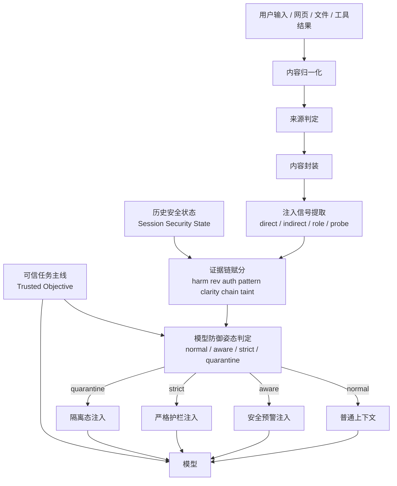
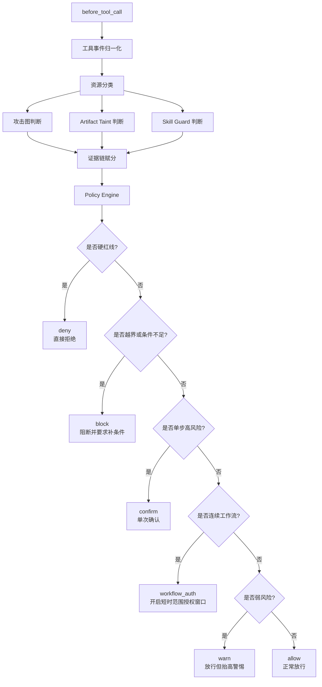

下面继续补两张细图。

**1. 模型侧提示词注入防护子流程图**

这张图对应的语义是：

- 先把外部内容分清楚“谁有指令权，谁只是数据”。
- 再提取注入信号，接入新版证据链赋分。
- 最后不是直接让模型判断能不能执行，而是先决定给模型戴多厚的护栏：
  - `normal`
  - `aware`
  - `strict`
  - `quarantine`

也就是：

- 模型防线负责“不被带偏”
- 不负责“最后拍板”

---

**2. `before_tool_call` 裁决树图**

这张图里几种语义可以再对应得更直白一点：

- `deny`
  - 红线
  - 用户确认也不放
- `block`
  - 现在不行
  - 需要补条件、缩范围、看清内容后再来
- `confirm`
  - 这一步可以做
  - 但必须你明确批准这一次
- `workflow_auth`
  - 不是批一次
  - 是给一个短时、限范围的连续施工窗口
- `warn`
  - 先放
  - 但后续护栏拉高
- `allow`
  - 正常通过

---

**3. 新版证据链赋分在这两张图里的位置**
你刚才特别提醒“别漏掉新版证据链赋分”，这里再明确一下它在两张图里的职责：

在模型侧图里：

- 它决定模型护栏厚度
- 也就是 `normal / aware / strict / quarantine`

在工具侧图里：

- 它不直接决定最终放行
- 而是给 `Policy Engine` 提供风险热度、攻击链推进程度、taint 污染程度

所以新版赋分层不是旧时代那种“一个总分裁决天下”，而是：

- 模型侧：决定护栏姿态
- 工具侧：决定灰区升级路径
- 输出侧：决定泄漏严重度和替换等级

如果你认可这两张细图，下一步我就把它们整理成正式设计文档结构，并开始进入“新工作树 + 分模块实施计划”。
