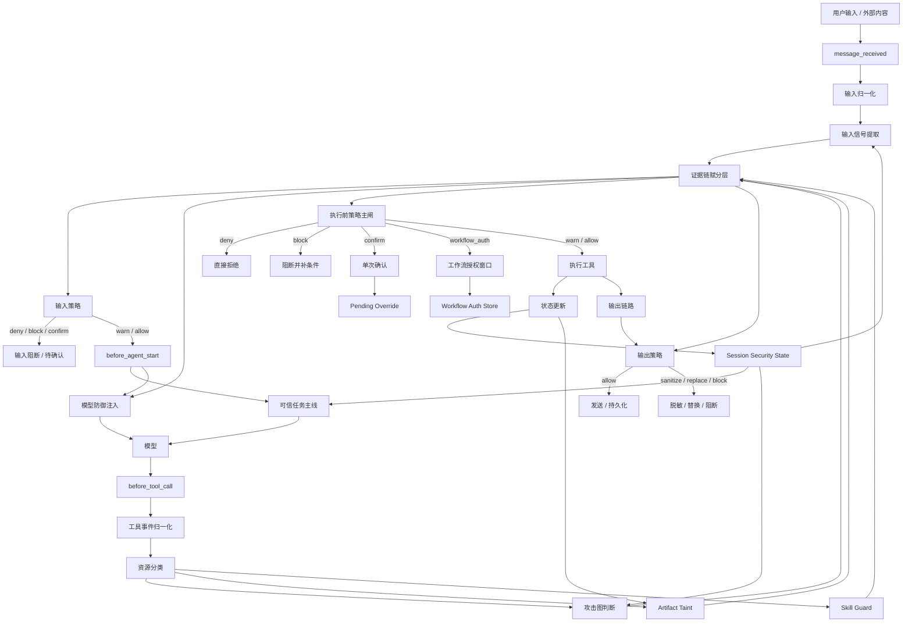
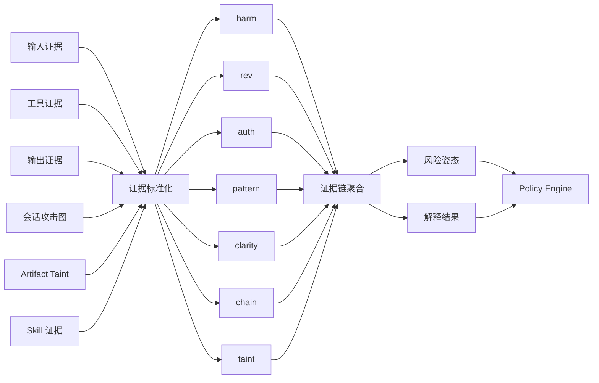
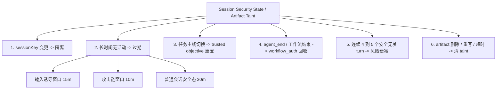

把它拆成 3 张更小的图来画，这样更容易显示，也把“新版证据链赋分”单独画进去了。

**1. 总体新架构图**

**2. 新版证据链赋分图**

这张图里可以这样理解：

- 旧 5 维保留：`harm / rev / auth / pattern / clarity`
- 新增 2 维：`chain / taint`
- 聚合后不是直接替代裁决，而是给 `Policy Engine` 提供：
  - `风险姿态`
  - `解释结果`

也就是：

- 赋分层负责“把证据热度算清楚”
- `Policy Engine` 负责“最后拍板”

**3. 状态持续检测与回收图**

如果这次能正常显示，我下一步就继续给你画两张更细的图：

1. `模型侧提示词注入防护子流程图`
2. `confirm / workflow_auth / block / deny` 的决策树图
